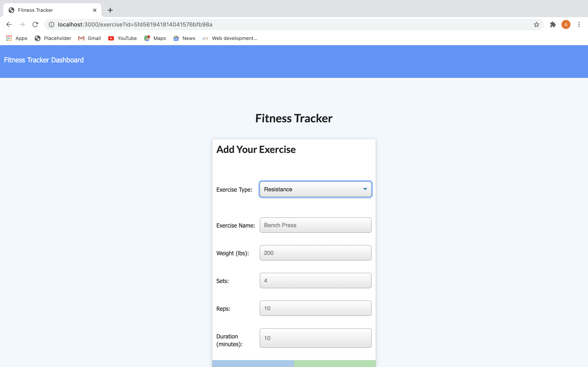
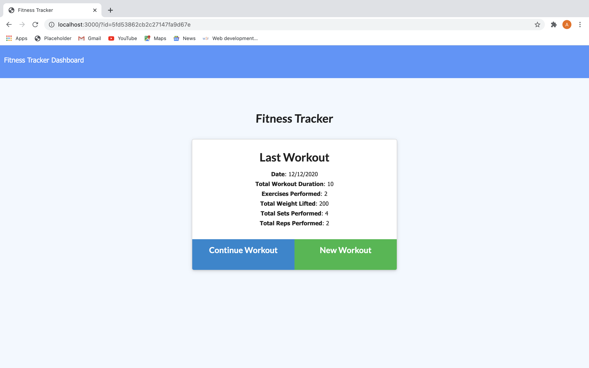
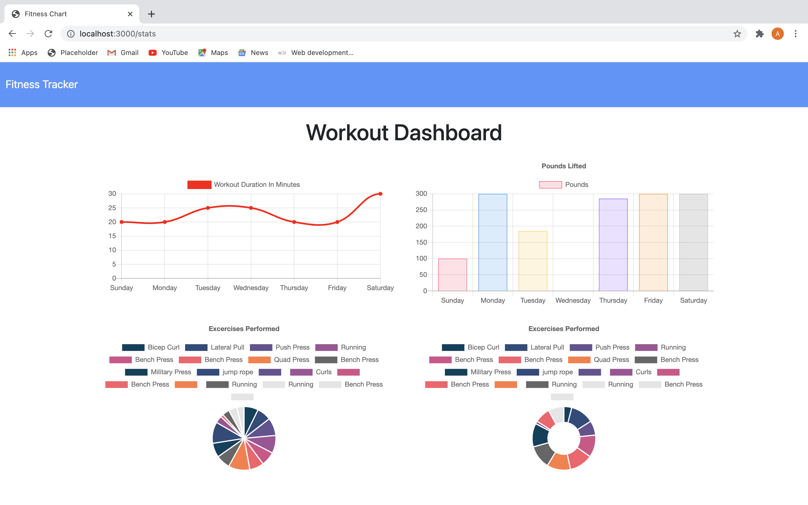

# Fitness Tracker 
        
## Discription 
This is a fitness tracker to help you track your workouts and your progress.
        
## Table of Contents 
* [Installation](#Installation)
        
* [Installation](#Installation)
        
* [Usage](#Usage)
        
* [License](#License)
        
* [Contributing](#Contributing)
        
* [Tests](#Tests)
        
* [Questions](#Questions)
        
## Installation 
To install, you must fork the repo and then copy the files onto your computer.  Then 'npm install', 'npm start"
        
## Usage 

[Click to try out Fitness Tracker](https://arcane-harbor-72010.herokuapp.com/stats)
        
## License 
ISC
        
## Contributing 
Allan
        
## Tests 
 Manually tested on local server.
        
## Questions 
[chefbrams](https://github.com/chefbrams)
         
Contact me by email with any further questions.
        
oldcitycatering@gmail.com  

        